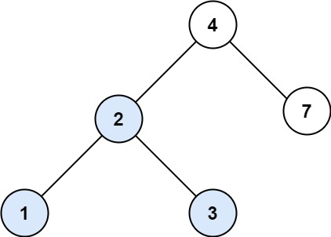
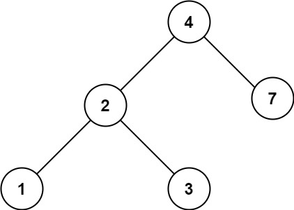

**700. Search in a Binary Search Tree**

You are given the root of a binary search tree (BST) and an integer val.  
Find the node in the BST that the node's value equals val and return the subtree rooted with that node.   
If such a node does not exist, return null.  

**Example 1:**  
  
**Input:** root = [4,2,7,1,3], val = 2   
**Output:** [2,1,3]   
**Explanation:**  
Level 1 sum = 1.  
Level 2 sum = 7 + 0 = 7.  
Level 3 sum = 7 + -8 = -1.  
So we return the level with the maximum sum which is level 2.  

**Example 2:**  
  
**Input:** root = [4,2,7,1,3], val = 5   
**Output:** []    

**Constraints:**
- The number of nodes in the tree is in the range [1, 5000].
- 1 <= Node.val <= 107
- root is a binary search tree.
- 1 <= val <= 107